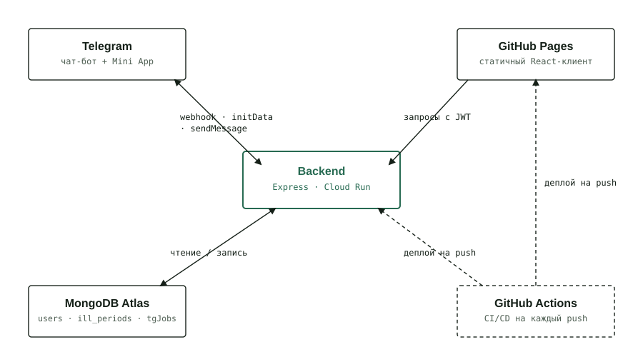

# check-health
Health tracker Web app with a Telegram bot integration. Tell the bot when a cold starts and ends, and it keeps statistics for you. Open the Mini App straight from your chat with the bot to see your full history at a glance — no sign-up, no password, no extra app to install.

Purpose:
Collect data of diseases, medical tests, show statistics

 

## Demo
Here is a working live [demo](https://elvirkin1392.github.io/check-health/)



## Links

- https://tlgrm.ru/docs/bots/api
- https://cloud.google.com/run/?hl=en
- https://console.cloud.google.com/


### Run server
```
cp .env.template .env    # only first time, fill created file with relevant variables
npm install              # only first time or after dependencies updates
npm run dev
```

### Run web
```
cd client/
cp .env.template .env    # only first time, fill created file with relevant variables
npm install              # only first time or after dependencies updates
npm run dev
```

## Stack
React · TypeScript · Vite · Express · MongoDB Atlas · node-cron · Telegram Bot API · JWT · Jest · GitHub Actions · GitHub Pages · Google Cloud Run

## Deployment

Every push to `master` runs three GitHub Actions pipelines automatically:

- **CI** — typecheck, lint, tests, build (client and server)
- **Deploy client to GitHub Pages** — builds `client/` and publishes it (skipped for server-only changes)
- **Deploy server to Cloud Run** — deploys the backend via `gcloud run deploy --source .` (skipped for client-only changes)

No manual `npm run deploy` needed for normal changes.

### Required GitHub secrets/variables

Settings → Secrets and variables → Actions:

| Name | Type | Used for |
|---|---|---|
| `GCP_SA_KEY` | Secret | Service account JSON key authenticating the Cloud Run deploy |
| `CHECK_HEALTH_TELEGRAM_BOT_TOKEN` | Secret | Telegram bot token, passed to Cloud Run |
| `CHECK_HEALTH_DB_HOST` | Secret | MongoDB Atlas connection string, passed to Cloud Run |
| `JWT_SECRET` | Secret | Signs login tokens, passed to Cloud Run |
| `CHECK_HEALTH_TELEGRAM_WEBHOOK_SECRET` | Secret | Verifies incoming Telegram webhook requests, passed to Cloud Run |
| `VITE_CHECK_HEALTH_API_HOST` | Secret or Variable | Backend URL baked into the client build at compile time |
